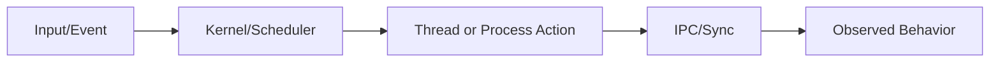
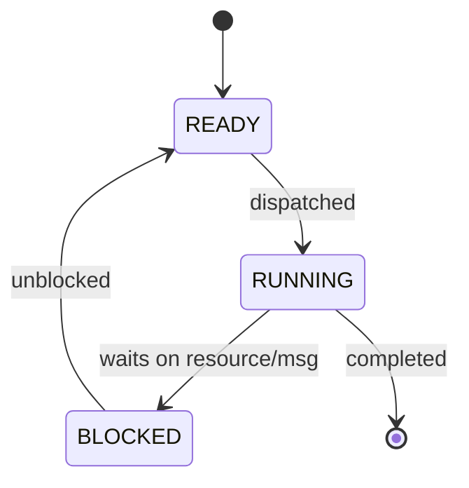
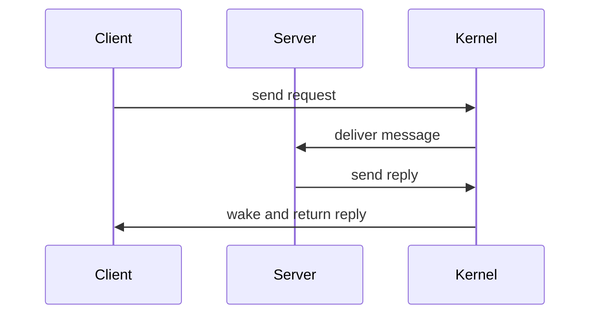
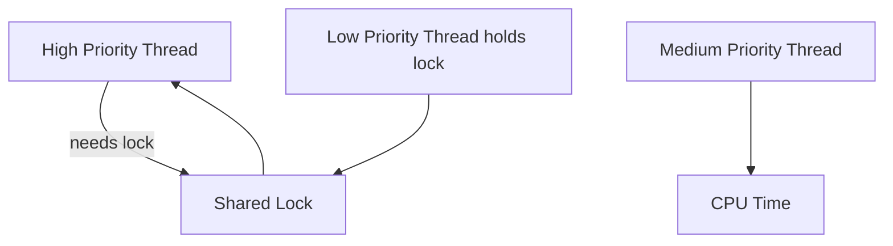

# Diagram Patterns For QNX Lesson Guides

Use one pattern per guide. Keep diagram small and readable.

## 1) Concept Flow (default)

Use when explaining cause-and-effect.

## 2) State Progression

Use when a thread/process changes state over time.

## 3) Request/Reply IPC

Use when describing message-passing or service interactions.

## 4) Priority Interaction

Use when explaining scheduling and inversion risk.

Below the diagram, add a one-sentence explanation that states the practical consequence.
