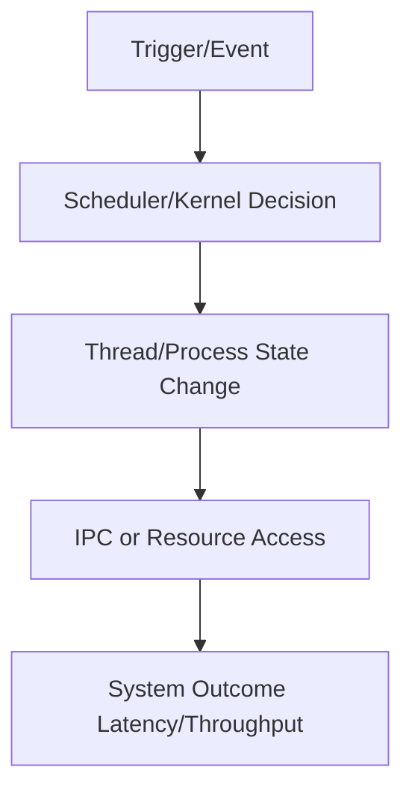

# QNX Lesson Guide Template

Use this exact template and keep it concise.

## Lesson Snapshot

- Lesson:
- Core objective:
- Where this appears in real systems:
- What to be able to do after this lesson:

## Core Concepts

1. Concept:
Why this matters:

2. Concept:
Why this matters:

3. Concept:
Why this matters:

4. Concept:
Why this matters:

5. Concept:
Why this matters:

## Mental Model Diagram



Interpretation:

## Worked Examples

### Example A: Code-Oriented

Context:

Key steps:

Minimal snippet:

```c
// Keep snippets short and lesson-specific.
// Replace APIs with the ones used in the transcript topic.
int main(void) {
    // init
    // create thread/process/channel as relevant
    // execute core real-time operation
    // handle error path
    return 0;
}
```

What to remember:

### Example B: System Behavior

Scenario:

What goes wrong:

How to reason about it:

Practical fix:

## Common Pitfalls

- Pitfall:
  Avoid by:
- Pitfall:
  Avoid by:
- Pitfall:
  Avoid by:
